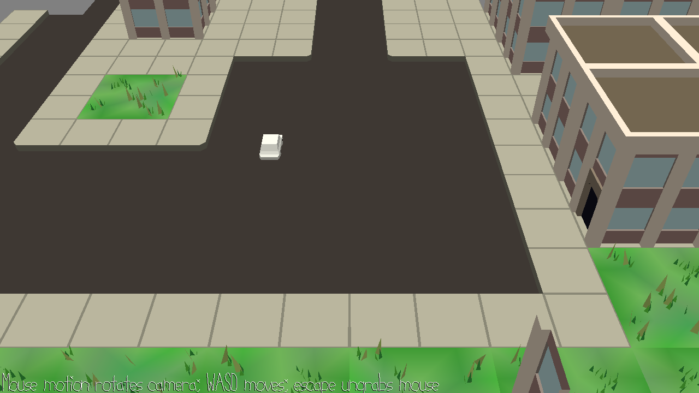

# RACE!

Author: Wenxuan Ou, Tejas Srivatsav

Design: Player can drive the car and explore the city.

Screen Shot:

How Your Asset Pipeline Works:

Assets are created in Blender. The scene contains roads, buildings, and the car model. The blender file is processed by python scripts and converted to .pnct mesh data and .scene shader data. The data will then loaded in to the game by PlayMode.cpp.

How To Play:

WASD to control speed and direction.

Sources: City scene comes from the provided asset in homework. Wenxuan Ou added the simple car model. 

This game was built with [NEST](NEST.md).

